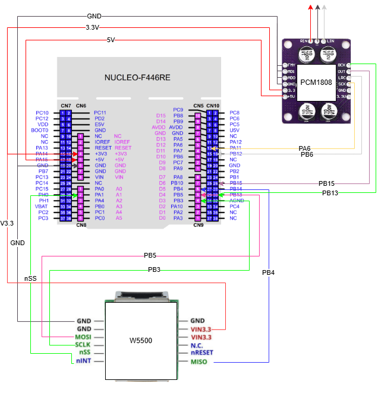
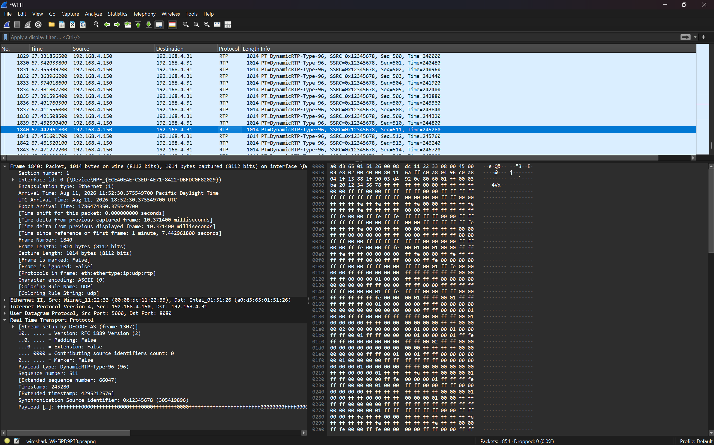
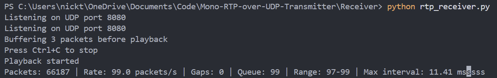
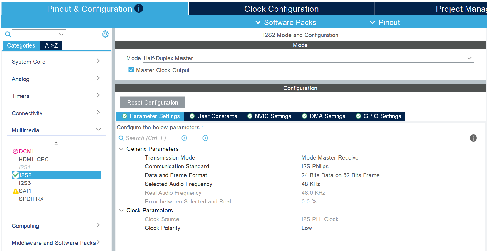
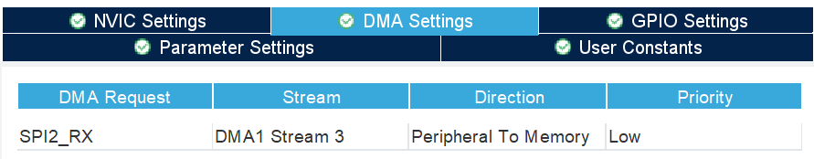
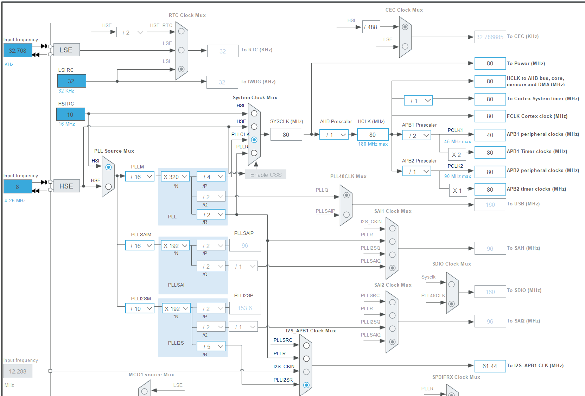

# STM32 RTP Audio Streamer

Real-time mono audio streaming from a PCM1808 ADC over RTP/UDP using an STM32F446, W5500 Ethernet controller, and Python receiver.

The STM32 captures digital audio from the PCM1808 over I2S using DMA, converts the incoming stereo frames to mono signed 16-bit PCM, builds RTP packets, and transmits the stream over Ethernet. A Python receiver validates the RTP stream, buffers the PCM audio, plays it through the computer, and can save the received stream as a WAV file.

## Demo
[](https://youtu.be/DueHSDACnAA)
### Hardware



*STM32 Nucleo-F446RE with PCM1808 audio input and W5500 Ethernet interface.*

### RTP Stream



Wireshark can be used to inspect the live RTP stream, including sequence numbers, timestamps, payload type, packet size, and packet timing.

```text
RTP version:            2
Payload type:           96
Sequence increment:     1
Timestamp increment:    480
PCM payload size:       960 bytes
RTP packet size:        972 bytes
Target packet rate:     100 packets/second
Audio per packet:       10 ms
```

### Received Audio



*Audio received over the network and recorded by the Python receiver.*

### STM32 Configuration

#### I2S Audio Input



The STM32 receives digital audio from the PCM1808 using the I2S interface.

#### DMA



Circular DMA continuously transfers incoming I2S audio into memory. Half-transfer and full-transfer callbacks allow the application to process one half of the buffer while DMA continues filling the other.

#### Clock Configuration



*STM32CubeMX clock configuration used for the MCU and audio peripherals.*

## Project Goals

* Capture external audio using I2S and DMA
* Stream mono PCM audio across an Ethernet network
* Build RTP version 2 packets manually in embedded C
* Interface an STM32 with a W5500 Ethernet controller over SPI
* Receive and play the RTP stream using Python
* Inspect packet timing, sequence numbers, and timestamps with Wireshark
* Separate firmware into clear hardware, audio, network, transport, and application modules

## Current Status

* [x] STM32 and W5500 SPI communication
* [x] Static IPv4 and UDP configuration
* [x] RTP version 2 packet generation
* [x] Sequence number and timestamp tracking
* [x] Signed 16-bit PCM serialization in network byte order
* [x] PCM1808 audio capture over I2S
* [x] Circular DMA audio input buffer
* [x] DMA half-transfer and full-transfer callbacks
* [x] Stereo input to mono PCM conversion
* [x] Transmission of 480 audio samples per RTP packet
* [x] Python RTP receiver
* [x] Real-time audio playback
* [x] WAV recording of received audio
* [x] RTP inspection using Wireshark
* [ ] Improve packet scheduling and reduce arrival jitter
* [ ] Add a timestamp-based jitter buffer
* [ ] Add configurable network and audio settings
* [ ] Add stream discovery and receiver subscription

## System Overview

```text
Analog audio input
        |
        v
PCM1808 audio ADC
        |
        | I2S
        v
STM32F446
        |
        | Circular DMA
        v
Stereo to mono conversion
        |
        | 16-bit PCM
        v
RTP packet builder
        |
        v
UDP socket
        |
        v
W5500 over SPI
        |
        v
Ethernet network
        |
        v
Python RTP receiver
        |
        +----> Audio playback
        |
        +----> WAV recording
```

## Audio and Packet Format

```text
Transport:              RTP over UDP
Audio format:           Signed 16-bit linear PCM
Channels transmitted:   1 (mono)
Sample rate:             48,000 Hz
Samples per packet:      480
Audio per packet:        10 ms
RTP payload type:        96
RTP header size:         12 bytes
Audio payload size:      960 bytes
UDP payload size:        972 bytes
```

Each successfully transmitted packet increments:

```text
RTP sequence number: +1
RTP timestamp:       +480
```

At 48 kHz, 480 samples represent 10 ms of mono audio, giving a target transmission rate of 100 RTP packets per second.

## Data Flow

The PCM1808 supplies stereo I2S frames to the STM32. Circular DMA continuously transfers the incoming audio into a buffer divided into two halves.

When a DMA half is complete:

1. The DMA callback marks that half of the buffer as ready.
2. `App_Run()` processes the completed audio block.
3. One channel is extracted into a 480-sample mono PCM buffer.
4. `RTP_SendAudio()` creates the RTP packet.
5. Each signed 16-bit PCM sample is serialized in network byte order.
6. The completed packet is sent through the W5500 UDP socket.
7. The Python receiver validates the RTP packet and extracts the PCM payload.
8. Received audio is buffered for playback and can also be written to a WAV file.

## RTP Packet Layout

Each UDP payload contains one RTP packet:

```text
Bytes 0-1       RTP version, flags, marker, and payload type
Bytes 2-3       Sequence number
Bytes 4-7       Timestamp
Bytes 8-11      SSRC
Bytes 12-971    480 signed 16-bit mono PCM samples
```

PCM samples are transmitted most-significant byte first. The Python receiver converts the samples from network byte order before playback.

## Hardware

* STM32 Nucleo-F446RE
* PCM1808 audio ADC module
* W5500 Ethernet module
* Ethernet-connected computer
* Analog audio source

## Firmware Architecture

```text
Core/
├── Inc/
│   ├── app.h
│   ├── audio.h
│   ├── audio_input.h
│   ├── audio_sine.h
│   ├── debug_uart.h
│   ├── network.h
│   ├── rtp.h
│   ├── udp_stream.h
│   └── w5500_port.h
│
└── Src/
    ├── main.c
    ├── app.c
    ├── audio.c
    ├── audio_input.c
    ├── audio_sine.c
    ├── debug_uart.c
    ├── network.c
    ├── rtp.c
    ├── udp_stream.c
    └── w5500_port.c

Receiver/
├── README.md
├── requirements.txt
└── rtp_receiver.py

docs/
├── architecture.md
├── Wiring.drawio
└── images/
    ├── hardware_setup.jpg
    ├── wireshark_rtp.png
    ├── received_audio.png
    ├── cubemx_i2s.png
    ├── cubemx_dma.png
    └── cubemx_clock.png
```

## Firmware Modules

* `main.c` — CubeMX-generated startup, clock configuration, and peripheral initialization
* `app.c` — Top-level application control and processing of completed DMA buffers
* `audio.c` — Audio subsystem initialization
* `audio_input.c` — I2S DMA buffer, callbacks, and buffer-ready state
* `audio_sine.c` — Sine-wave and DAC test support used during development
* `rtp.c` — RTP header construction, PCM serialization, sequence numbers, and timestamps
* `udp_stream.c` — W5500 UDP socket and destination configuration
* `network.c` — W5500 network configuration
* `w5500_port.c` — STM32 HAL interface for W5500 SPI, chip select, and reset
* `debug_uart.c` — UART debug output
* `Receiver/rtp_receiver.py` — RTP validation, buffering, PCM conversion, playback, and WAV recording

## Network Configuration

The current firmware uses static network configuration.

```text
W5500 IP address:       192.168.4.150
Subnet mask:            255.255.255.0
Gateway:                192.168.4.1
W5500 local UDP port:   5000
Receiver UDP port:      8080
```

The W5500 network configuration is located in:

```text
Core/Src/network.c
```

The destination address is configured in:

```text
Core/Src/udp_stream.c
```

For example:

```c
static uint8_t target_ip[4] = {192, 168, 4, 34};
static uint16_t target_port = 8080;
```

Change `target_ip` to the IPv4 address of the computer running the receiver.

## Build and Run

### 1. Clone the Repository

Clone the repository and the Wiznet ioLibrary submodule:

```bash
git clone --recurse-submodules https://github.com/ntchaps/STM32-RTP-Audio-Streamer.git
cd STM32-RTP-Audio-Streamer
```

If the repository was already cloned without its submodules:

```bash
git submodule update --init --recursive
```

### 2. Configure and Flash the STM32

1. Open the project in STM32CubeIDE.
2. Verify the W5500 network configuration in `Core/Src/network.c`.
3. Set the receiver computer's IPv4 address in `Core/Src/udp_stream.c`.
4. Connect the PCM1808 and W5500 hardware.
5. Build the project.
6. Flash the firmware to the Nucleo-F446RE.

### 3. Run the Python Receiver

From the repository root:

```bash
cd Receiver
python -m venv .venv
```

Activate the virtual environment on Windows PowerShell:

```powershell
.venv\Scripts\Activate.ps1
```

Install the required packages:

```bash
python -m pip install -r requirements.txt
```

Start the receiver:

```bash
python rtp_receiver.py
```

The receiver listens on UDP port `8080` and processes the incoming stream as 48 kHz mono signed 16-bit PCM.

See [`Receiver/README.md`](Receiver/README.md) for additional receiver information.

## Wireshark Verification

Use the following display filter:

```text
udp.port == 8080
```

If Wireshark initially identifies the traffic only as UDP:

```text
Analyze -> Decode As -> RTP
```

A correct stream should show approximately:

```text
RTP version:             2
Payload type:            96
Sequence increment:      1
Timestamp increment:     480
PCM payload size:        960 bytes
RTP packet size:         972 bytes
Target packet rate:      100 packets/second
Target packet interval:  10 ms
```

## Current Limitations

* Packet transmission is handled by the application loop after DMA callbacks rather than a dedicated packet scheduler
* UDP packet arrival times can vary even though each RTP packet represents 10 ms of audio
* The receiver does not currently reorder out-of-order packets
* Missing packets are not reconstructed or concealed
* RTP timestamps are not yet used to schedule playback
* The receiver currently uses a basic packet queue rather than an adaptive jitter buffer
* Network addresses and audio settings are fixed in source code

## Planned Improvements

* Improve RTP packet scheduling
* Add receiver packet-loss and jitter statistics
* Add timestamp-based packet ordering and playout
* Add packet-loss concealment or silence insertion
* Add a configurable jitter buffer
* Add configurable network and audio settings
* Add transmitter discovery and receiver subscription

## Skills Demonstrated

* Embedded C
* Python
* STM32 HAL
* STM32CubeIDE / STM32CubeMX
* I2S digital audio
* DMA and interrupt callbacks
* SPI peripheral communication
* W5500 Ethernet control
* UDP socket programming
* RTP packet construction
* PCM audio representation
* Endianness and network byte order
* Real-time audio buffering
* Wireshark packet analysis
* Hardware/software integration
* Modular embedded firmware design

## Documentation

See [`docs/architecture.md`](docs/architecture.md) for the firmware architecture, module responsibilities, and complete audio data path.
